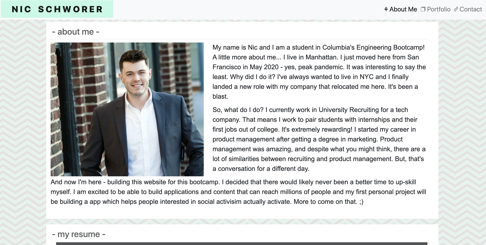

# 02_Responsive_Website

LINK TO PAGE: https://nicschworer.github.io/02_Responsive_Portfolio/

The assignment was to create a responsive portfolio website. 

To develop this, I used HTML, CSS. Building the actual website wasn't too challenging, it was making it responsive and adaptable to mobile that was tricky. I used media queries to alter the page renderings depending on how the size of the screen. 

Here is a photo of what it looks like: 

